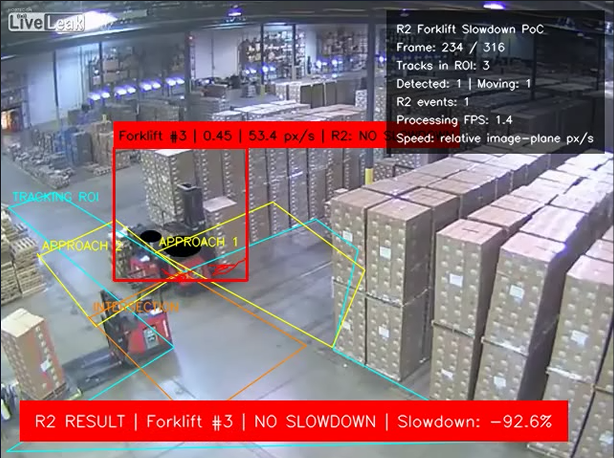
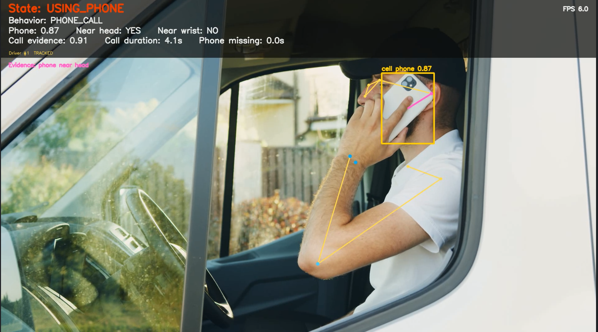
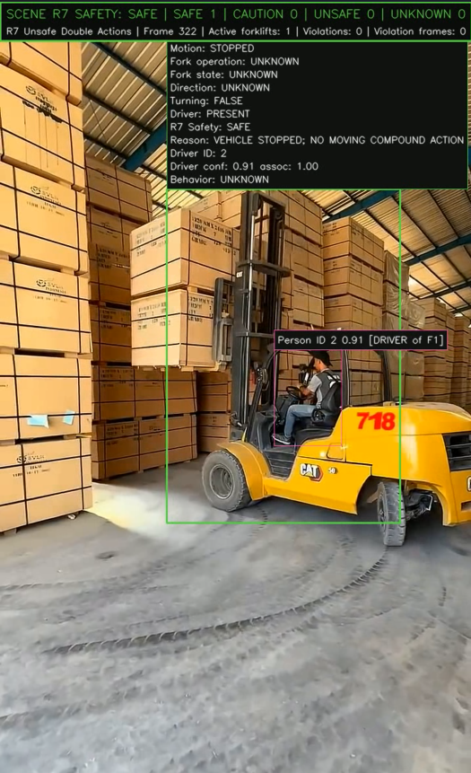

# warehouse-forklift

## Sample outputs

### R2 — Forklift slowdown detection



**Method:**

- **Detection and tracking:** A custom YOLO model (`best_fresh.pt`) detects the
  `forklift` class in each frame. Its bounding boxes and confidence scores are
  passed to ByteTrack, which assigns a persistent track ID to each forklift.
  The default ByteTrack thresholds are `0.10` (low-confidence association),
  `0.25` (high-confidence association), and `0.30` (new track), with a
  two-second track buffer for temporary occlusion. Implausibly large boxes,
  tracks outside the configured area, and duplicate overlapping IDs are
  removed after tracking.
- **Configured areas:** The scene contains one **Tracking ROI**, two
  **Approach Zones**, and one **Intersection Zone**. The Tracking ROI limits
  where valid forklift tracks are accepted. Approach Zones 1 and 2 cover the
  road sections immediately before the intersection for the two possible
  travel directions. The Intersection Zone is the blind-corner area in which
  slowdown is evaluated.
- **Zone membership:** The bottom-center point of the smoothed forklift box is
  used as its ground-contact position. A zone transition must be observed for
  at least two consecutive frames to reduce boundary jitter. The Intersection
  Zone takes precedence if polygons overlap.
- **Speed estimation:** Speed is calculated from the displacement of the
  bottom-center point over a `0.40 s` window, converted to image-plane pixels
  per second, and smoothed with an exponential moving average.
- **Approach baseline:** A track must be motion-confirmed and move from an
  Approach Zone into the Intersection Zone within three seconds. At least five
  valid approach-speed samples are required. The baseline is the median of up
  to the 15 most recent samples and must be at least `10 px/s`.
- **R2 decision:** After intersection entry, the speed history is restarted so
  approach samples cannot leak into the intersection estimate. The median of
  the first three valid intersection-speed samples is compared with the
  approach baseline:

  ```text
  slowdown_ratio = (approach_speed - intersection_speed) / approach_speed
  ```

  A slowdown ratio of at least `0.20` (20%) produces `SLOWED`; otherwise the
  result is `NO_SLOWDOWN`. The track ID, zone, both speeds, slowdown percentage,
  and result are written to the event output.

### R6 — Phone usage detection



**Method:**

- **Driver and phone detection:** YOLO pose estimates the selected driver's
  body and keypoints, while a pretrained COCO YOLO model detects phones. The
  detector resolves the `cell phone` class from the model's class names. The
  same driver is associated across frames and accepted poses are smoothed to
  reduce keypoint jitter.
- **Phone search areas:** Phone detection runs on the full frame or configured
  driver ROI and on higher-resolution local crops around the left wrist, right
  wrist, both hands, and head. All candidates are mapped back to full-frame
  coordinates and deduplicated with IoU NMS.
- **Spatial evidence:** Distances are normalized by the driver's body scale.
  A phone near a head keypoint/head ROI supports `PHONE_CALL`; a phone near a
  wrist and inside the driver's body region supports `HANDHELD_PHONE_USE`; and
  a phone below the head in the viewing region supports `WATCHING_PHONE`.
  Merely detecting a visible phone does not count as phone use.
- **Temporal decision:** Independent evidence must remain continuous for
  `0.6 s` for a call, `1.0 s` for handheld use, or `1.5 s` for watching. Call
  evidence has the highest priority. Once active, `USING_PHONE` is released
  only after `0.7 s` of insufficient evidence; an established call can also
  survive a short phone-detector miss when the associated wrist remains near
  the head.
- **Output:** The final state is `USING_PHONE` for any confirmed call,
  handheld-use, or watching pathway; otherwise it is `NORMAL`. Annotated video
  and event files include the behavior, phone confidence, pose evidence, and
  timestamps.

### R7 — Unsafe double-action detection



**Method:**

- **Object tracking:** Separate YOLO pipelines detect forklifts and people.
  ByteTrack preserves their IDs through short occlusions, while fragmented
  forklift body, mast, or fork detections are geometrically fused before
  association.
- **Fork and mast analysis:** A custom segmentation model runs on an expanded
  crop around each tracked forklift. Mast and fork masks are selected and
  merged, then the fork position is projected along the mast axis and
  normalized by forklift height.
- **Vehicle motion:** The smoothed forklift trajectory is normalized by its
  bounding-box diagonal. Its velocity determines whether the vehicle is moving;
  changes between trajectory legs determine turning; and the motion direction
  relative to the fork-facing vector determines `FORWARD` or `REVERSE`.
- **Fork motion:** A robust regression over the recent normalized fork-height
  history estimates its slope. Positive, negative, and near-zero trends are
  classified as `LOWERING`, `RAISING`, and `STATIC`, with hysteresis to prevent
  rapid state changes from noisy masks.
- **Driver association:** A person track is associated with a forklift using
  driver-ROI overlap, person/forklift overlap, motion similarity, and temporal
  continuity. Missing or ambiguous evidence is treated as `UNKNOWN`, not as
  proof that no driver is present.
- **R7 decision:** An R7 violation requires a confirmed driver and continuous
  compound evidence for at least `0.50 s`. The monitored combinations are
  `REVERSE + LOWERING`, `TURN + LOWERING`, and `REVERSE + TURN + LOWERING`.
  Fork operation while the vehicle is stopped is reported as safe within the
  R7 scope; a machine-level candidate with unknown operator evidence is
  reported as caution rather than a confirmed violation.

## Setup and usage

```powershell
uv sync

# Run tools without manually activating the environment
uv run --frozen python r7/test-tracking/scripts/r7_demo.py
uv run --frozen python r2/test-tracking/scripts/r2_demo.py
uv run --frozen python r2/test-tracking/scripts/track_forklift.py
uv run --frozen python r6-2/infer_camera.py

# Optional activation for an IDE terminal
.\.venv\Scripts\Activate.ps1
```

Select `.venv\Scripts\python.exe` as the Python/Jupyter interpreter. The lock
uses Python 3.12, Ultralytics 8.4.116, and the PyTorch CUDA 13.0 wheels shared by
the detection, pose, tracking, segmentation, notebook, and ONNX workflows.
